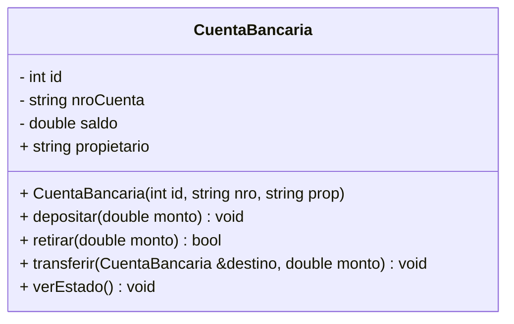

# Práctica C++: Sistema de Gestión Bancaria (POO)

Este proyecto consiste en el desarrollo de una clase denominada `CuentaBancaria` que simula las operaciones financieras esenciales de una entidad bancaria. El objetivo es profundizar en el concepto de **encapsulamiento** y practicar la **interacción entre múltiples instancias** de una misma clase mediante transferencias de fondos.

---

## 1. Estructura de la Clase `CuentaBancaria`

El estudiante debe implementar la clase siguiendo estrictamente el siguiente diseño de miembros y niveles de visibilidad:

| Miembro | Tipo | Modificador | Descripción |
| :--- | :--- | :--- | :--- |
| `id` | Atributo (int) | **Private (-)** | Identificador interno del sistema. |
| `nroCuenta` | Atributo (string) | **Private (-)** | Código único de cuenta (Ej: "2026-X"). |
| `saldo` | Atributo (double) | **Private (-)** | Monto de dinero disponible (Protegido). |
| `propietario` | Atributo (string) | **Public (+)** | Nombre completo del titular. |
| **Constructor** | Método | **Public (+)** | Inicializa los datos y establece el saldo en 0.0. |
| `depositar()` | Método | **Public (+)** | Incrementa el saldo tras validación. |
| `retirar()` | Método (bool) | **Public (+)** | Disminuye el saldo tras validación de fondos. |
| `transferir()` | Método | **Public (+)** | Mueve fondos entre dos objetos Cuenta. |
| `verEstado()` | Método | **Public (+)** | Imprime la información financiera del objeto. |

## 2. LOGICA Y VALIDACIONES DE METODOS

La implementacion de la clase debe garantizar la integridad del saldo mediante el cumplimiento estricto de las siguientes reglas de negocio:

### A. Metodo: void depositar(double monto)
Este metodo es el unico canal autorizado para el ingreso de capital al objeto.
- Validacion: Se debe verificar que el parametro 'monto' sea mayor a cero (0.0).
- Ejecucion: De cumplirse la validacion, se incrementara el atributo privado 'saldo'. En caso contrario, se debe emitir un mensaje de error indicando que no se procesan montos negativos o nulos.

### B. Metodo: bool retirar(double monto)
Este metodo gestiona la salida de capital y actua como un filtro de seguridad financiera.
- Validacion 1: El monto solicitado debe ser un valor positivo.
- Validacion 2 (Control de Fondos): El monto solicitado no debe exceder el valor actual del atributo 'saldo'.
- Retorno: Si ambas condiciones son favorables, se deduce el monto del saldo y el metodo retorna 'true'. Ante cualquier fallo en las validaciones, se retorna 'false' y se notifica la causa del rechazo.

### C. Metodo: void transferir(CuentaBancaria &destino, double monto)
Este metodo representa la interaccion directa entre dos instancias de la clase 'CuentaBancaria'.
- Procedimiento: El objeto de origen (this) debe intentar realizar un retiro mediante el metodo 'retirar(monto)'.
- Integridad: Solo si el metodo 'retirar' confirma el exito de la operacion (retorno true), el objeto de origen debe proceder a llamar al metodo 'destino.depositar(monto)'.
- Seguridad: Se recomienda validar que el objeto 'destino' sea una instancia distinta a la de origen para evitar transferencias redundantes.

---

## 3. REQUERIMIENTOS DEL PROGRAMA PRINCIPAL (MAIN)

El estudiante debe demostrar el flujo de trabajo de la clase mediante una secuencia controlada de operaciones en el archivo principal:

1. Instanciacion: Crear dos objetos de la clase 'CuentaBancaria' (ejemplo: 'cuentaA' y 'cuentaB') con identificadores y nombres de titulares distintos.
2. Carga de Capital: Ejecutar un deposito inicial en la 'cuentaA' para establecer un fondo de maniobra.
3. Prueba de Robustez: Intentar realizar un retiro en 'cuentaA' que exceda el saldo disponible para verificar el correcto funcionamiento de las validaciones de seguridad.
4. Ejecucion de Transferencia: Realizar una transferencia exitosa desde 'cuentaA' hacia 'cuentaB'.
5. Auditoria de Estado: Invocar el metodo 'verEstado()' para ambos objetos al finalizar las operaciones, confirmando la consistencia de los saldos finales en ambas cuentas.

---

## EJEMPLO DE INTERACCION EN CONSOLA

ESTADO INICIAL:
Titular: Juan Perez | Saldo: $1000.00
Titular: Maria Lopez | Saldo: $0.00

EJECUTANDO TRANSFERENCIA...
Monto solicitado: $450.00

NOTIFICACION DEL SISTEMA:
- Retiro de cuenta Juan Perez: CONFIRMADO
- Deposito en cuenta Maria Lopez: CONFIRMADO
- Resultado: Operacion completada con exito.

ESTADO FINAL:
1. Cuenta 001 | Titular: Juan Perez | Saldo Actual: $550.00
2. Cuenta 002 | Titular: Maria Lopez | Saldo Actual: $450.00