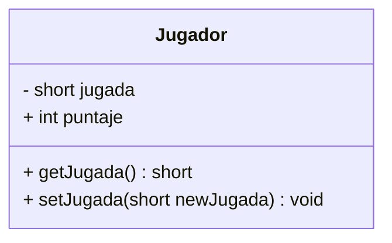

# Práctica de Programación: Piedra, Papel o Tijera (Versión POO)
## Introducción a la Programación Orientada a Objetos en C++

Este repositorio contiene la evolución del algoritmo clásico "Piedra, Papel o Tijera", migrando de un paradigma de programación estructurada hacia la **Programación Orientada a Objetos (POO)**. El objetivo principal es aplicar conceptos de encapsulamiento mediante el uso de clases, atributos privados y métodos de acceso.

---

## Descripción del Desafío

El estudiante debe reestructurar el código base del juego para que toda la información de los participantes sea gestionada a través de instancias de una clase llamada `Jugador`. El flujo del programa seguirá siendo secuencial dentro del `main()`, pero la manipulación de datos debe hacerse estrictamente mediante los métodos definidos en la clase.

### Especificaciones de la Clase `Jugador`
La clase debe presentar la siguiente estructura de visibilidad:

| Elemento | Tipo | Modificador | Descripción |
| :--- | :--- | :--- | :--- |
| `jugada` | Atributo | **Private (-)** | Almacena la opción elegida (1, 2 o 3). |
| `puntaje` | Atributo | **Public (+)** | Acumulador de partidas ganadas. |
| `getJugada()` | Método | **Public (+)** | Retorna el valor actual del atributo `jugada`. |
| `setJugada(n)` | Método | **Public (+)** | Asigna un nuevo valor al atributo `jugada`. |

---

###  Diagrama de Clase (UML)

Para comprender la estructura del objeto y su visibilidad (encapsulamiento), se presenta el siguiente diagrama basado en el estándar UML:
Los metodos de acceso se los incorpor como parte de los metodos solo con fines educativos, en futuras oportunidades, se asumiran que estos deben ser implementados en el codigo, sin necesidad de definirlos como tal en el diagrama de clases


## Pautas de Implementación

Para completar el programa de forma correcta, el estudiante debe seguir estas pautas secuenciales:

### 1. Clase Jugador
Debe declarar la clase `Jugador` antes de la función principal. Asegúrese de que el atributo `jugada` sea privado para demostrar el concepto de **encapsulamiento**.


### 2. Instanciación y Captura
En el `main()`, se deben crear dos objetos: `j1` y `j2`. Al solicitar las jugadas al usuario, los valores ingresados no pueden asignarse directamente a los objetos. Se debe utilizar una variable auxiliar y luego enviarla a través del método `setJugada()`.

```cpp
short aux;
cout << "Jugador 1, elija su jugada: ";
cin >> aux;
j1.setJugada(aux);
```

### 3. Definición de la Clase `Jugador`
El estudiante debe implementar la siguiente estructura en su archivo:

```cpp
class Jugador {
private:
    short jugada; // Acceso restringido

public:
    int puntaje;  // Acceso directo (simplificado para esta práctica)

    // Método Getter: Retorna el valor de la jugada
    short getJugada() {
        return jugada;
    }

    // Método Setter: Asigna un nuevo valor a la jugada
    void setJugada(short newJugada) {
        jugada = newJugada;
    }
};
```

### Tabla de Validación Lógica
Se debe comprobar que el flujo de datos pase correctamente del usuario al objeto, y del objeto al motor de comparación:

| Caso | Entrada J1 | Entrada J2 | Lógica Interna (Getters) | Resultado Esperado |
| :--- | :---: | :---: | :--- | :--- |
| **Victoria J1** | `1` | `3` | `j1.getJugada() == 1` vs `j2.getJugada() == 3` | GANO EL JUGADOR 1 |
| **Victoria J2** | `2` | `3` | `j1.getJugada() == 2` vs `j2.getJugada() == 3` | GANO EL JUGADOR 2 |
| **Empate** | `3` | `3` | `j1.getJugada() == j2.getJugada()` | EMPATE |
| **Encapsulamiento** | N/A | N/A | `cout << j1.jugada;` | **ERROR DE COMPILACIÓN** |


---

### 🧪 Verificación de Puntaje (Atributos Públicos)
Después de cada comparación, se debe confirmar que el objeto ganador ha actualizado su atributo `puntaje`. El estudiante puede utilizar este bloque como referencia para su salida en consola:

```text
// Escenario: El Jugador 1 elige Piedra (1) y el Jugador 2 elige Tijera (3)
()  VS  8<

GANO EL JUGADOR 1

[ESTADO ACTUAL]
Puntaje J1: 1
Puntaje J2: 0