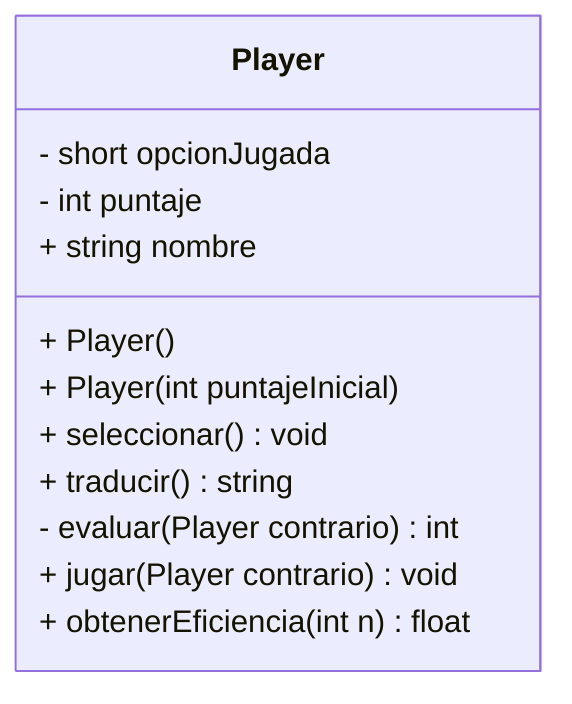

# Guía de Práctica: Programación Orientada a Objetos Avanzada
## Proyecto: Player vs Player - Sistema de Duelo Automatizado

En esta cuarta etapa, evolucionamos hacia un modelo donde la clase `Player` posee autonomía. Ya no es el `main` quien realiza la lógica de comparación, sino que los objetos tienen la capacidad de **evaluar a sus contrincantes** y gestionar su propia eficiencia.

---

## 1 Estructura de la Clase `Player`

El estudiante deberá implementar la clase siguiendo estrictamente el siguiente diseño de miembros:

| Miembro | Tipo | Modificador | Descripción |
| :--- | :--- | :--- | :--- |
| `opcionJugada` | Atributo (short) | **Private (-)** | Selección (1: Piedra, 2: Papel, 3: Tijera). |
| `puntaje` | Atributo (int) | **Private (-)** | Acumulador de victorias. |
| `nombre` | Atributo (string) | **Public (+)** | Identificador del jugador. |
| **Constructor** | Método | **Public (+)** | Por defecto e inicializador de puntaje. |
| `seleccionar()` | Método | **Public (+)** | Captura la jugada desde consola. |
| `traducir()` | Método (string) | **Public (+)** | Retorna `()`, `[]` o `8<`. |
| `evaluar(Player)` | Método (int) | **Private (-)** | Compara la jugada propia contra otro objeto. |
| `jugar(Player)` | Método | **Public (+)** | Orquesta el duelo, traduce e incrementa puntaje. |
| `obtenerEficiencia(n)`| Método (float) | **Public (+)** | Calcula el % de éxito según partidas. |


	
## 2. Lógica de los Métodos Principales

Para cumplir con el diseño modular, el estudiante debe implementar la lógica interna de la clase `Player` bajo los siguientes criterios:

### A. Método Privado `evaluar(Player contrario)`
Es el núcleo lógico del juego. Debe comparar la `opcionJugada` del objeto actual (`this`) contra la del objeto `contrario`. 
- **Retorno 1:** Si el objeto actual vence al contrario.
- **Retorno 0:** Si ambos tienen la misma jugada (Empate).
- **Retorno -1:** Si el objeto actual es vencido.

### B. Método Público `jugar(Player contrario)`
Este método orquesta el encuentro entre dos instancias. Debe seguir esta secuencia:
1. Invocar internamente al método `evaluar(contrario)`.
2. Utilizar el método `traducir()` para mostrar visualmente el duelo:  
   `this->nombre (this->traducir()) VS contrario.nombre (contrario.traducir())`.
3. **Gestión de Puntos:** - Si el resultado es `1`, incrementar `this->puntaje`.
   - Si el resultado es `-1`, incrementar `contrario.puntaje`.
4. Imprimir en consola el mensaje del ganador de la ronda.

### C. Método Público `obtenerEficiencia(int nroPartidas)`
Debe calcular y retornar el rendimiento del jugador. 
- **Fórmula:** `(puntaje / nroPartidas) * 100.0`.
- **Nota:** Asegúrese de que el retorno sea de tipo `float` para representar correctamente los decimales.


---

## 3. Requerimientos del Programa Principal (`main`)

El estudiante debe demostrar la capacidad de interacción entre múltiples objetos siguiendo un flujo de competencia rotativa:

1. **Instanciación:** Crear 3 objetos de la clase `Player` (ej. `p1`, `p2`, `p3`).
2. **Ciclo de Juego:** Implementar un bucle (loop) para ejecutar **3 partidas** con la siguiente mecánica de enfrentamiento:
    * **Fase 1:** El Jugador 1 selecciona su opción y se enfrenta al Jugador 2: `p1.jugar(p2)`.
    * **Fase 2:** El Jugador 2 selecciona su opción y se enfrenta al Jugador 3: `p2.jugar(p3)`.
3. **Estadísticas Finales:** Una vez concluido el bucle, el programa debe imprimir el nombre y el porcentaje de eficiencia de los 3 jugadores invocando `obtenerEficiencia(3)`.


---

## Ejemplo de Interacción en Consola
## Ejemplo de Interacción en Consola

El programa debe presentar una interfaz limpia y descriptiva similar a la siguiente:

```text
===========================================
          DUELO DE JUGADORES (POO)
===========================================

[PARTIDA 1: SubZero vs Scorpion]
SubZero, elija (1: Piedra, 2: Papel, 3: Tijera): 1
Scorpion, elija (1: Piedra, 2: Papel, 3: Tijera): 3

SubZero ( )  VS  Scorpion 8<
>>> RESULTADO: ¡SubZero gana la ronda!

[PARTIDA 2: Scorpion vs Reptile]
Scorpion, elija (1: Piedra, 2: Papel, 3: Tijera): 2
Reptile, elija (1: Piedra, 2: Papel, 3: Tijera): 2

Scorpion [ ]  VS  Reptile [ ]
>>> RESULTADO: Empate técnico.

-------------------------------------------
RESUMEN DE EFICIENCIA (Tras 3 Partidas):
-------------------------------------------
1. SubZero  : 33.3%
2. Scorpion : 0.0%
3. Reptile  : 0.0%
===========================================