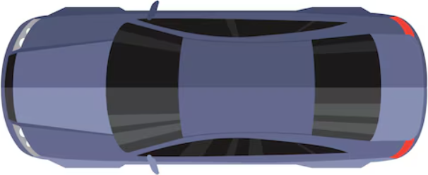

# Ejercicio: Movimiento de Sprites y Personalización en Unity

En esta práctica, aprenderás a crear un script modular en C# que controla el movimiento en 2D y la orientación visual de un objeto. El objetivo principal es comprender cómo los **Campos Serializados** (Serialized Fields) en el Inspector de Unity permiten definir comportamientos únicos para diferentes objetos utilizando un mismo código base.

## Objetivos de Aprendizaje
* Implementar la lógica de movimiento 2D mediante vectores.
* Gestionar el intercambio de *Sprites* y la propiedad *Flip* según la dirección del movimiento.
* Configurar múltiples GameObjects con velocidades y apariencias personalizadas desde el Editor.

## Configuración del Proyecto
1.  Crea un nuevo proyecto en Unity usando la plantilla **2D Core**.
2.  Importa al menos dos sprites diferentes para tu personaje: uno para la vista horizontal (derecha) y otro para la vista vertical (arriba).
3.  Crea un nuevo script de C# llamado `PlayerController.cs`.

## Descripción del Script
El script `PlayerController.cs` se encarga de tres tareas fundamentales:

1.  **Variables de Control:** * `speed`: Controla la rapidez del desplazamiento.
    * `horizontalSprite` / `verticalSprite`: Almacenan las referencias visuales del personaje.
2.  **Función Move():** * Calcula el desplazamiento del objeto multiplicando la dirección por la velocidad y el tiempo transcurrido (Time.deltaTime). Esto asegura que el movimiento sea fluido independientemente de los FPS de la computadora.
3.  **Función ChangeSprite():** * Detecta hacia dónde se mueve el jugador.
    * Si se mueve horizontalmente, asigna el sprite de lado y usa la propiedad `flipX` para mirar a la izquierda.
    * Si se mueve verticalmente, asigna el sprite vertical y usa `flipY` para mirar hacia abajo.

## Instrucciones para el Estudiante
1.  **Asigna** el script a un GameObject que tenga un componente `SpriteRenderer`.
2.  **Configura** los sprites en las ranuras correspondientes del Inspector (arrastra y suelta tus imágenes).
3.  **Crea Variaciones:** Crea tres GameObjects distintos en tu escena (por ejemplo: un "Tanque" lento y un "Fantasma" muy rápido). 
    * Configura cada uno con diferentes velocidades y sprites para comprobar la versatilidad del script.

## Criterios de Evaluación
* El objeto debe moverse correctamente en los 4 ejes (W, A, S, D o flechas).
* El sprite debe cambiar de orientación de forma coherente con la dirección.
* Uso correcto de `Time.deltaTime` para un movimiento estable.
* Personalización de al menos 2 objetos con diferentes velocidades y sprites.

# Guía de Implementación: Controlador de Movimiento Mediante Enumeradores

Este documento describe la estructura y lógica del script PlayerController.cs. En esta versión, se utiliza un enumerador para definir los puntos cardinales, permitiendo una configuración más intuitiva desde el Inspector de Unity.

## 1. Definición del Enumerador y Variables

El uso de un `enum` permite restringir las opciones de dirección a valores específicos (North, South, East, West). Los atributos definidos se configuran en el Inspector para cada instancia del objeto.

* **movementDirection**: Menú desplegable para seleccionar el punto cardinal.
* **speed**: Velocidad de desplazamiento constante.
* **horizontalSprite**: Asset visual para movimientos laterales.
* **verticalSprite**: Asset visual para movimientos verticales.

```csharp
public enum Direction { North, South, East, West }

[Header("Configuración de Movimiento")]
public Direction movementDirection;
public float speed = 3.0f;

[Header("Assets Visuales")]
public Sprite horizontalSprite;
public Sprite verticalSprite;

private SpriteRenderer _spriteRenderer;
private Vector2 _moveVector;
private bool _isMoving = false;

```

## 2. Inicialización y Configuración de Sprites: Start()

El método Start se ejecuta una sola vez al inicio de la aplicación. Su función en este script es doble: establecer la comunicación con el hardware de renderizado y pre-configurar la orientación visual del objeto basándose en la opción seleccionada en el enumerador.

### Lógica de Configuración
Mediante una estructura de control `switch`, el script evalúa la variable `movementDirection`. Dependiendo del punto cardinal elegido, se asigna un vector de movimiento (`Vector2`) y se ajustan las propiedades de rotación e inversión del `SpriteRenderer`.


* **Vector2.up / down / left / right**: Define hacia dónde se desplazará el objeto.
* **flipX / flipY**: Permite reutilizar un mismo sprite para direcciones opuestas (ej. usar el sprite de derecha e invertirlo para la izquierda).

### Código de Implementación

```csharp
void Start()
{
    // Obtención de la referencia del componente de renderizado
    _spriteRenderer = GetComponent<SpriteRenderer>();

    // Configuración lógica y visual según el punto cardinal seleccionado
    switch (movementDirection)
    {
        case Direction.North:
            _moveVector = Vector2.up;
            _spriteRenderer.sprite = verticalSprite;
            _spriteRenderer.flipY = false;
            break;
        case Direction.South:
            _moveVector = Vector2.down;
            _spriteRenderer.sprite = verticalSprite;
            _spriteRenderer.flipY = true;
            break;
        case Direction.East:
            _moveVector = Vector2.right;
            _spriteRenderer.sprite = horizontalSprite;
            _spriteRenderer.flipX = false;
            break;
        case Direction.West:
            _moveVector = Vector2.left;
            _spriteRenderer.sprite = horizontalSprite;
            _spriteRenderer.flipX = true;
            break;
    }
}

```
## 3. Control de Ejecución y Desplazamiento: Update() y Move()

Esta sección gestiona la interactividad y la actualización física del objeto cuadro a cuadro. La lógica se divide en la detección de una condición de inicio y la ejecución del desplazamiento constante.

### Lógica de Control (Update)
El método `Update` monitorea constantemente si el usuario presiona la tecla **Espacio**. Una vez detectada la pulsación, la variable booleana `_isMoving` cambia a verdadero, permitiendo que el objeto comience su trayecto de forma automática sin intervención adicional del teclado.

### Lógica de Desplazamiento (Move)
La función `Move` es la encargada de trasladar al objeto en el espacio bidimensional. 
* Se utiliza el vector `_moveVector` pre-calculado en el método `Start`.
* El factor `speed` determina la rapidez.
* El uso de `Time.deltaTime` es fundamental para que el movimiento sea independiente de la tasa de cuadros (FPS), garantizando que el objeto recorra la misma distancia por segundo en cualquier equipo.


### Código de Implementación

```csharp
void Update()
{
    // Detección del comando de inicio
    if (Input.GetKeyDown(KeyCode.Space))
    {
        _isMoving = true;
    }

    // Ejecución continua si el movimiento está activo
    if (_isMoving)
    {
        Move();
    }
}

void Move()
{
    // Aplica la traslación física al transform del objeto
    // Fórmula: Dirección * Velocidad * TiempoTranscurrido
    transform.Translate(_moveVector * speed * Time.deltaTime);
}

```

## 4. Requisitos de los Assets Visuales y Orientación

Para que el sistema de inversión (Flipping) funcione correctamente mediante código, los archivos de imagen importados a Unity deben cumplir con una orientación inicial específica. Esto evita la necesidad de crear cuatro animaciones distintas, optimizando el uso de memoria del proyecto.

### Orientación de los Archivos Originales

* **Sprite Horizontal**: La imagen original debe estar mirando hacia la **derecha (East)**. El script activará la propiedad `flipX` automáticamente cuando se seleccione la dirección *West*.
* **Sprite Vertical**: La imagen original debe estar mirando hacia **arriba (North)**. El script activará la propiedad `flipY` cuando se seleccione la dirección *South*.

### Referencia Visual de los Assets

A continuación, se muestran los sprites base que debe utilizar para configurar el componente en el Inspector:

**Imagen para movimiento lateral (horizontal.png):**


**Imagen para movimiento vertical (vertical.png):**



### Configuración en el Inspector
1. Seleccione su GameObject en la jerarquía.
2. En el componente `PlayerController`, arrastre el archivo `horizontal.png` al campo **Horizontal Sprite**.
3. Arrastre el archivo `vertical.png` al campo **Vertical Sprite**.
4. Asegúrese de que el "Mesh Type" del Sprite en Unity esté configurado como "Full Rect" o que el "Pivot" esté centrado para evitar desplazamientos visuales al realizar el flip.


**Nota:** Asegúrese de que el "Pivot" de sus sprites esté centrado para que la inversión no desplace al personaje fuera de su posición original.