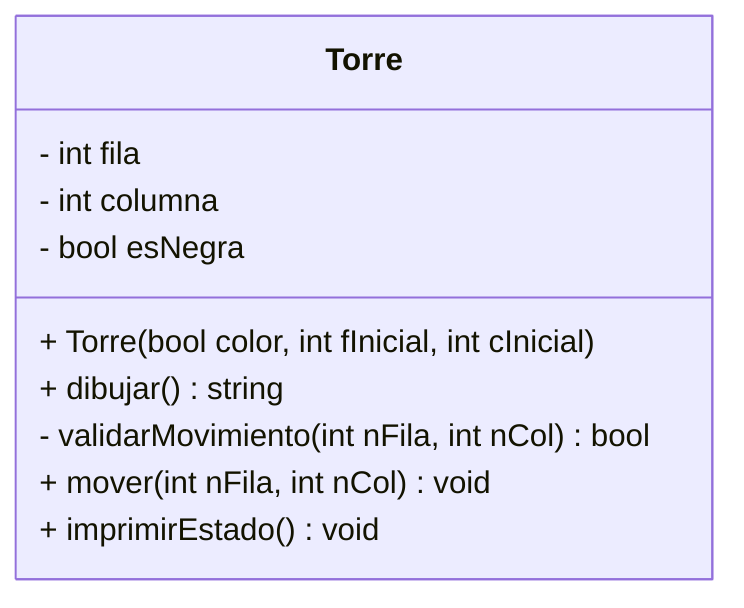

# Práctica C++: El Guardián de la Torre (Introducción a POO)

Este proyecto consiste en desarrollar una clase en C++ que simule el comportamiento de una pieza de ajedrez: **La Torre**. El objetivo es aplicar los conceptos fundamentales de la Programación Orientada a Objetos (POO), como el encapsulamiento, el estado del objeto y la validación de comportamiento.

---

## Descripción del Desafío

El estudiante debe crear una clase llamada `Torre` que gestione su ubicación en un tablero virtual de $8 \times 8$ (coordenadas 1-8). La clase debe ser capaz de determinar si un movimiento solicitado es legal y representarse visualmente en la consola de forma diferente según su color.

### Simbología Visual (ASCII)
Para diferenciar el color de la pieza sin usar colores de consola, utilizaremos la siguiente nomenclatura:

| Color | Representación (ASCII) | Significado |
| :--- | :---: | :--- |
| **Blanco** | `[TT]` | Torre Vacía / Blanca |
| **Negro** | `[##]` | Torre Rellena / Negra |

---

## 1. Estructura de la Clase `Torre`

El estudiante debe implementar la clase siguiendo estrictamente el siguiente diseño de miembros:

| Miembro | Tipo | Modificador | Descripción |
| :--- | :--- | :--- | :--- |
| `fila` | Atributo (int) | **Private (-)** | Posición vertical (1-8). |
| `columna` | Atributo (int) | **Private (-)** | Posición horizontal (1-8). |
| `esNegra` | Atributo (bool) | **Private (-)** | `true` si es negra, `false` si es blanca. |
| **Constructor** | Método | **Public (+)** | Inicializa color y posición (ej. [1,1]). |
| `dibujar()` | Método (string) | **Public (+)** | Retorna `[TT]` o `[##]` según `esNegra`. |
| `validarMovimiento`| Método (bool) | **Private (-)** | Verifica si el movimiento es recto. |
| `mover(nFila, nCol)`| Método | **Public (+)** | Actualiza posición si el movimiento es válido. |
| `imprimirEstado()`| Método | **Public (+)** | Muestra: `[TT] Blanca en Fila: 4, Col: 5`. |



## 2. Lógica de los Métodos Principales

El estudiante debe desarrollar la lógica interna de los métodos de la clase `Torre` bajo los siguientes criterios de programación:

### A. Método Privado `validarMovimiento(int nFila, int nCol)`
Este método actúa como el "cerebro" de la pieza. La Torre solo puede desplazarse en línea recta, por lo que el movimiento es legal si y solo si una de sus coordenadas permanece constante mientras la otra cambia.
- **Retorno true:** Si `(this->fila == nFila || this->columna == nCol)`. Esto indica un movimiento puramente horizontal o vertical.
- **Retorno false:** Si ambas coordenadas cambian simultáneamente (intento de movimiento diagonal) o si el destino es la misma posición actual.

[Image of a chess rook showing valid horizontal and vertical movement paths on a board]

### B. Método Público `mover(int nFila, int nCol)`
Este método es el encargado de actualizar el estado del objeto. Debe seguir esta secuencia lógica:
1. **Validación de Rango:** Verificar que `nFila` y `nCol` estén dentro de los límites del tablero (1 a 8).
2. **Validación de Regla:** Invocar al método privado `validarMovimiento(nFila, nCol)`.
3. **Actualización:** - Si las validaciones son exitosas, asignar los nuevos valores a `this->fila` y `this->columna`.
   - Si el movimiento es inválido, imprimir un mensaje de error descriptivo (ej: "Movimiento diagonal no permitido para la Torre").

### C. Método Público `dibujar()`
Este método permite la representación visual del objeto en la consola basándose en su estado interno.
- Si el atributo `esNegra` es

## 3. Requerimientos del Programa Principal (`main`)

El estudiante debe demostrar la correcta implementación del objeto `Torre` y su encapsulamiento siguiendo este flujo lógico en el `main`:

1. **Instanciación:** Crear al menos dos objetos de la clase `Torre`.
   - `t1`: Torre Blanca (parámetro `false`), posición inicial `[1, 1]`.
   - `t2`: Torre Negra (parámetro `true`), posición inicial `[8, 8]`.

2. **Interacción del Usuario:**
   - Mostrar el estado inicial de ambas torres usando el método `imprimirEstado()`.
   - Solicitar al usuario las coordenadas de destino (`nFila` y `nCol`) para intentar mover la **Torre Blanca**.
   - Invocar el método `t1.mover(nFila, nCol)`.

3. **Validación de Resultados:**
   - Mostrar el estado final de ambas piezas tras el intento de movimiento.
   - Verificar que, si el movimiento fue ilegal, la torre permanezca en su posición original `[1, 1]`.

---
## Ejemplo de Interacción en Consola

El programa debe presentar una interfaz clara que permita distinguir el estado de los objetos antes y después de cada acción:

```text
===========================================
          SISTEMA DE CONTROL: TORRE
===========================================

[ESTADO ACTUAL DEL TABLERO]
Pieza 1: [TT] Blanca en Fila: 1, Col: 1
Pieza 2: [##] Negra  en Fila: 8, Col: 8

-------------------------------------------
MOVIMIENTO: Torre Blanca [TT]
-------------------------------------------
Introduzca nueva Fila (1-8): 1
Introduzca nueva Columna (1-8): 6

>>> PROCESANDO...
>>> MOVIMIENTO EXITOSO: [TT] se ha desplazado.

-------------------------------------------
[NUEVO ESTADO DEL TABLERO]
Pieza 1: [TT] Blanca en Fila: 1, Col: 6
Pieza 2: [##] Negra  en Fila: 8, Col: 8
===========================================